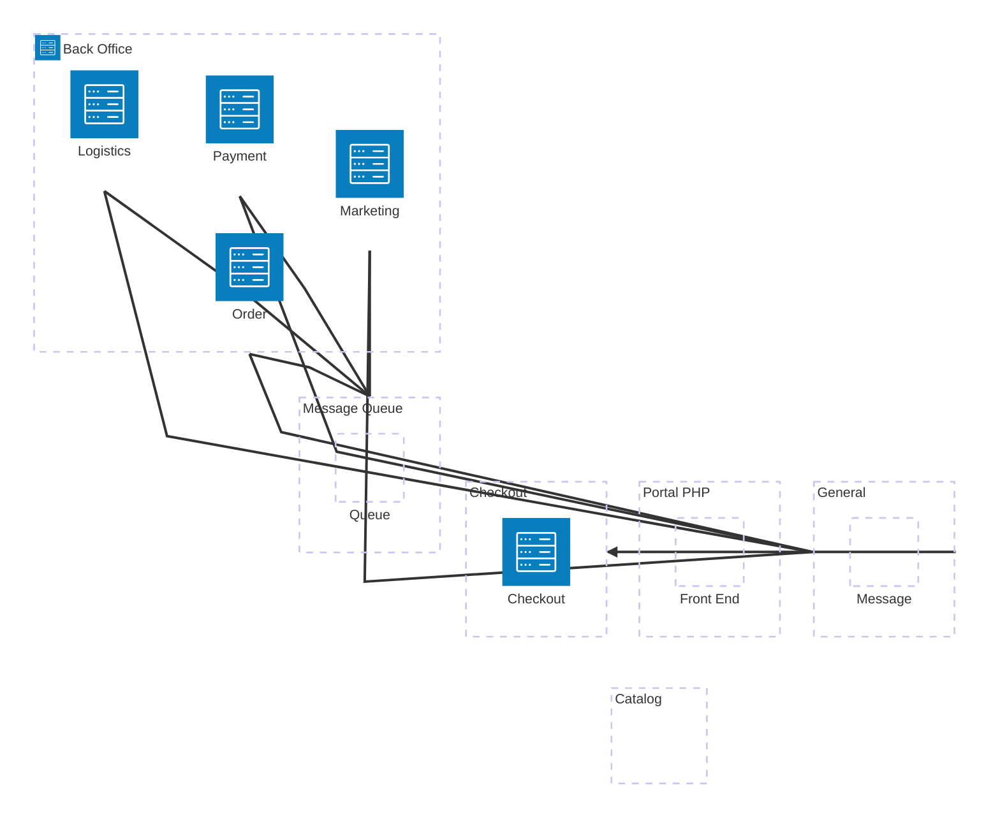

# Xu Passeios Travel Agency

```mermaid
architecture-beta

	group messagequeue[Message Queue]
	group backoffice(server)[Back Office]
	group common[General]
	group frontend[Portal PHP]
	group catalog[Catalog]
	group checkout[Checkout]
	
	service messagequeueService[Queue] in messagequeue
	service frontend2[Front End] in frontend

	service order(server)[Order] in backoffice
	service payment(server)[Payment] in backoffice
	service logistics(server)[Logistics] in backoffice
	service marketing(server)[Marketing] in backoffice
	service checkout2(server)[Checkout] in checkout
	
	service message[Message] in common	
	
	message{group}:R -- L:frontend2{group}	
	
	messagequeueService{group}:T -- B:payment{group}
	messagequeueService{group}:T -- B:order{group}
	messagequeueService{group}:T -- B:logistics{group}
	messagequeueService{group}:T -- B:marketing{group}

	frontend2{group}:L --> R:checkout2{group}

	message{group}:L -- B:payment{group}
	message{group}:L -- B:order{group}
	message{group}:L -- B:logistics{group}
	message{group}:L -- B:marketing{group}


```

Other(s)

How to execute

1. `cd XuPasseios`   
2. `docker-compose up`   
 

