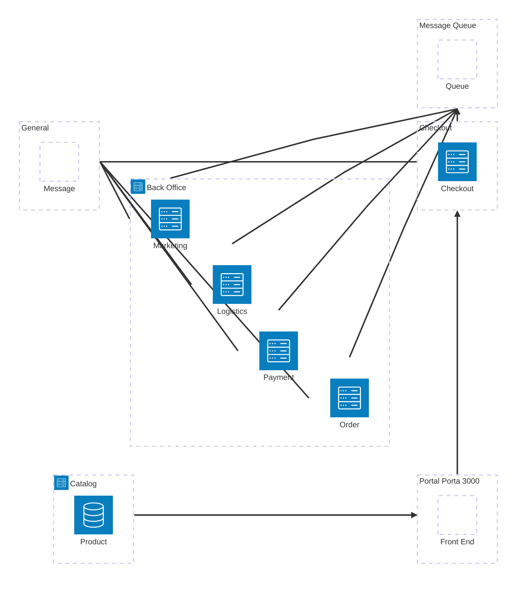

# Xu Passeios Travel Agency

Other(s)

How to execute

1. `cd XuPasseios`   
2. `docker-compose up`   
 

Reference(s)

[How to use certificates with Docker Container](https://learn.microsoft.com/en-us/aspnet/core/security/docker-https?view=aspnetcore-10.0)   
[How to use certificates with Docker Compose](https://learn.microsoft.com/en-us/aspnet/core/security/docker-compose-https?view=aspnetcore-10.0)   
[Set up Docker with TLS](https://www.labkey.org/Documentation/wiki-page.view?name=dockerTLS)  

